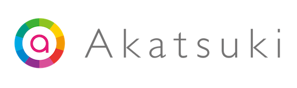
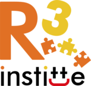
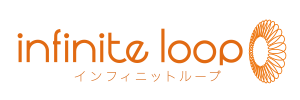
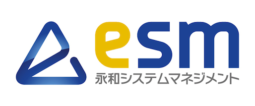
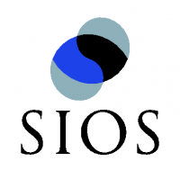
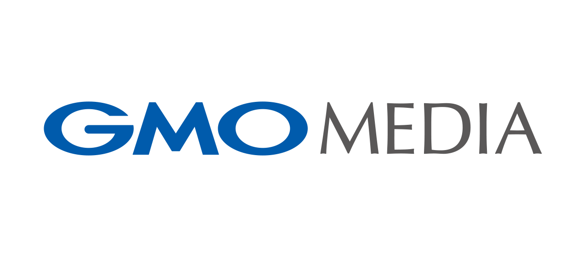

OSS Gateに協力しているみなさん（あいうえお順）です。ありがとうございます。

OSS Gateはみなさんの協力を待っています。協力の方法は[スポンサー募集](wanted.html)を見てください。

## 株式会社アカツキ {#akatsuki}

OSS Gate東京ふりかえりの会場を提供しています。

以下は会場を提供したイベントです。

- [OSS Gate東京ふりかえり2018-04](https://oss-gate.doorkeeper.jp/events/72010)

アカツキは、人々が心の満足で満たされ、自発的に行動し世界が発展する『感情を報酬に発展する社会』を実現できると信じております。
主力となるモバイルゲーム事業においては、心が動くワクワク体験を届ける様々なゲームの開発・運営を行っております。
また感動するリアルな体験を届けるライブエクスペリエンス事業をはじめとし、世界にワクワクとつながりをもたらす様々な事業を展開してまいります。

私達アカツキは2010年6月14日に創業した当初よりRuby等のOSSを使い続けてきました。
今日の事業はOSSがなかったとしたら成し得ていません。私たちの提供するゲームやサービスは、これからもOSSと共に歩んでいきます。

私たちの事業とOSSを一緒に盛り上げる、熱い情熱を持った仲間も[募集](https://aktsk.jp/recruit/)しています。

## アールスリーインスティテュート {#r3institute}

OSS Gate大阪ミートアップで会場を提供しています。

アールスリーインスティテュートは、AWSパートナー・kintoneパートナーとして全国で活動しています。
「ハイスピードSI」を提唱し、お客様が今必要なシステムを今お届けするべく日々システム開発を行っています。

クラウドを巧みに利用したシステム開発、他社は避けるような非常に難度の高い案件を得意としています。
また、「コミュニティにフルコミット」を標榜しており、社員のコミュニティ活動を積極的に支援しています。

## 株式会社インフィニットループ {#infiniteloop}

OSS Gate札幌ワークショップで会場を提供しています。

以下は会場を提供したイベントです。

- [OSS Gate札幌ワークショップ2017-06-17](https://oss-gate.doorkeeper.jp/events/59699)
- [OSS Gate札幌ワークショップ2017-03-18](https://oss-gate.doorkeeper.jp/events/54641)
- [OSS Gate札幌ワークショップ2017-01-21](https://oss-gate.doorkeeper.jp/events/54640)
- [OSS Gateワークショップin札幌2016-11-26](https://oss-gate.doorkeeper.jp/events/50662)
- [OSS Gateワークショップin札幌2016-09-24](https://oss-gate.doorkeeper.jp/events/50661)

私たちは札幌に本社を構え、LAMP（CentOS/Ubuntu、Apache/Nginx、MySQL/KVS、PHP）及びUnityを用いた、
ゲーム開発やモバイル向けアプリケーション開発をメイン事業としたシステム会社です。
現在では150名以上のエンジニアを抱え、技術的アプローチを得意とし、有名タイトルを多数手がけており、
最近ではVRやIoTなど、ゲーム開発で培った技術力とノウハウを糧に幅広く事業展開を進めています。

## 株式会社永和システムマネジメント {#esm}

OSS Gate東京ミートアップ、OSS Gate東京もくもく会、OSS Gate東京フォローアップの会場を提供しています。

以下は会場を提供したイベントです。

- ...
- [OSS Gate東京もくもく会＆フォローアップ2018-09-19](https://oss-gate.doorkeeper.jp/events/78729)
- [OSS Gate東京もくもく会2018-08-06](https://oss-gate.doorkeeper.jp/events/77543)
- [OSS Gate東京フォローアップ2018-07-02](https://oss-gate.doorkeeper.jp/events/75940)
- [OSS Gate東京もくもく会2018-06-25](https://oss-gate.doorkeeper.jp/events/75939)
- [OSS Gate東京もくもく会2018-05-21](https://oss-gate.doorkeeper.jp/events/74026)
- [OSS Gate東京もくもく会2018-04-24](https://oss-gate.doorkeeper.jp/events/73435)
- [OSS Gate東京ミートアップ2018-03-01](https://oss-gate.doorkeeper.jp/events/70883)
- [OSS Gate東京ミートアップ2018-01-29](https://oss-gate.doorkeeper.jp/events/69403)
- [OSS Gate東京ミートアップ2017-12-18](https://oss-gate.doorkeeper.jp/events/68119)
- [OSS Gate東京ミートアップ2017-11-22](https://oss-gate.doorkeeper.jp/events/66982)
- [OSS Gate東京ミートアップ2017-10-23](https://oss-gate.doorkeeper.jp/events/65754)
- [OSS Gate東京ミートアップ2017-08-28](https://oss-gate.doorkeeper.jp/events/63053)
- [OSS Gate東京ミートアップ2017-07-13](https://oss-gate.doorkeeper.jp/events/62157)
- [OSS Gate東京ミートアップ2017-06-19](https://oss-gate.doorkeeper.jp/events/61030)
- [OSS Gate東京ミートアップ2017-05-22](https://oss-gate.doorkeeper.jp/events/60514)
- [OSS Gate東京ミートアップ2017-04-13](https://oss-gate.doorkeeper.jp/events/59418)
- [OSS Gate東京ミートアップ2017-03-30](https://oss-gate.doorkeeper.jp/events/58374)
- [OSS Gate東京ミートアップ2017-02-20](https://oss-gate.doorkeeper.jp/events/56845)
- [OSS Gate東京ミートアップ2017-01-16](https://oss-gate.doorkeeper.jp/events/55608)

社員がOSS Gateワークショップに参加するための交通費を支援しています。

以下は交通費を支援したイベントです。

- ...
- [OSS Gateワークショップin札幌2016-09-24](https://oss-gate.doorkeeper.jp/events/50661)で2名

私たちは、ソフトウェア開発のプロフェッショナルとしての誠実な態度と、アジャイル開発のアプローチを通じて「お客さまに価値を提供し続けるシステム」を構築し、お客さまと一緒に育てていきます。アジャイルと Ruby の組み合わせが実現するシステム開発は、開発者が充実感と「楽しさ」を感じられる開発であり、そこにはきっとビジネス価値がある――私たちはそう信じて行動を続けています。

アジャイルと Ruby の組み合わせが実現するシステム開発に関心のある方は[応募](https://www.wantedly.com/projects/28670)してください。

## 株式会社えにしテック {#enishi-tech}

[株式会社えにしテック](https://www.enishi-tech.com/) TODO：ロゴ

OSS Gate札幌キックオフの会場を提供しています。

- TODO（会場提供してくれたキックオフのイベントページ）

TODO（会社説明とか宣伝文句）

## 株式会社SEプラス {#seplus}

OSS Gate東京キックオフ・ふりかえりの会場とチラシを提供しています。

- [RubyKaigi 2017で配布するOSS Gateのチラシを印刷](https://gitter.im/oss-gate/general?at=59bb4780cfeed2eb650f09f4)
- [OSS Gate東京ふりかえり2017-09](https://oss-gate.doorkeeper.jp/events/63831)
- [OSS Gate東京ふりかえり2017-01 ~ 2017-04](https://oss-gate.doorkeeper.jp/events/59283)
- [OSS Gate ふりかえり 2016](https://oss-gate.doorkeeper.jp/events/54119)
- [OSS Gate を立ち上げよう](https://oss-gate.doorkeeper.jp/events/33335)

2015年に学生向けに[OSS Hack Weekend](https://www.seplus.jp/sezemi/ohw/)というイベントを開催しました。そのイベントがきっかけで OSS Gateを応援しています。現在はPHP/Laravelを中心としたOSSを利用して、エンジニア向け研修サービスを開発しています。

## 関西Ruby会議2017実行委員会 {#kanrk2017}

OSS Gate大阪ワークショップの会場を提供しています。

以下は会場を提供したイベントです。

- [OSS Gate大阪ワークショップ2017-05-27](https://oss-gate.doorkeeper.jp/events/59634)

関西最大級の Rubyist のお祭りイベントです。関西内外からたくさんの Rubyist が集まります。関西Ruby会議2017 のテーマは Ruby Community and Ruby Business です。

## Quipper Ltd {#quipper}

OSS Gate東京ワークショップの会場を提供しています。

以下は会場を提供したイベントです。

- [OSS Gate東京ワークショップ2019-01-26](https://oss-gate.doorkeeper.jp/events/85222)

Quipperは、"Distributors of Wisdom" （「世界の果てまで最高の学びを届けよう」）というビジョンのもと、日本、インドネシア、フィリピンおよびメキシコにてオンライン学習サービスを提供しています。 
2013年より生徒の学習、先生の宿題管理・問題作成などのオンラインラーニングプラットフォームである『Quipper School』、オンライン講義動画である『Quipper Video』をインドネシア・フィリピンを中心に展開し、2015年に株式会社リクルートマーケティングパートナーズの一員となりました。日本国内では『スタディサプリ』を展開し、2017年度末には国内外サービス累計有料会員が74万人となりました。

## 株式会社クラウドワークス {#crowdworks}

OSS Gate東京ワークショップの会場を提供しています。

- ...
- [OSS Gate東京ワークショップ2018-01-27](https://oss-gate.doorkeeper.jp/events/68516)
- [OSS Gate東京ワークショップ2017-11-25](https://oss-gate.doorkeeper.jp/events/66254)
- [OSS Gate東京ワークショップ2017-07-29](https://oss-gate.doorkeeper.jp/events/61378)
- [OSS Gate東京ワークショップ2017-05-27](https://oss-gate.doorkeeper.jp/events/59202)
- [OSS Gate東京ワークショップ2017-03-25](https://oss-gate.doorkeeper.jp/events/57049)
- [OSS Gate東京ワークショップ2017-01-28](https://oss-gate.doorkeeper.jp/events/52881)
- [OSS Gateワークショップ2016-11-26](https://oss-gate.doorkeeper.jp/events/50539)
- [OSS Gateワークショップ2016-09-24](https://oss-gate.doorkeeper.jp/events/46275)
- [OSS Gateワークショップ2016-07-30](https://oss-gate.doorkeeper.jp/events/42159)

クラウドワークスは多くのOSSを活用してサービスを提供しています。そのOSSやOSSを開発する人を応援するためにOSS Gateに協力しています。

## クラスメソッド株式会社 {#classmethod}

OSS Gate大阪ワークショップの会場を提供しています。

以下は会場を提供したイベントです。

- [OSS Gate大阪ワークショップ2017-04-22](https://oss-gate.doorkeeper.jp/events/58579)

クラスメソッド株式会社は、「クラウド、ビッグデータ、モバイル、音声認識」の技術を活用した企業向けの技術支援を行っており、これまでに1500件以上の実績を持っています。また、2015年よりAWSプレミアコンサルティングパートナーとして多くのお客様のAWS導入および活用を支援し、お客様ビジネスに貢献しています。全社的な取り組みとして社員による情報発信に力を入れており、オウンドメディア「[Developers.IO](http://dev.classmethod.jp/)」にて約1万本以上の技術情報を公開しています。また、多様な働き方を支える取り組みにも力を入れ、2013年に東京ワークライフバランス認定企業に認定されました。

## 株式会社クリアコード {#clear-code}

- ロゴのライセンス：[CC BY-SA 4.0](https://creativecommons.org/licenses/by-sa/4.0/)
- ロゴの原著作者：株式会社クリアコード

社員が業務時間の一部でOSS Gateワークショップに参加することを認めています。

以下は社員が業務時間の一部で参加したイベントです。

- ...
- [OSS Gate東京ワークショップ2018-01-27](https://oss-gate.doorkeeper.jp/events/68516)で3名
- [OSS Gate東京ワークショップ2017-11-25](https://oss-gate.doorkeeper.jp/events/66254)で2名
- [OSS Gate東京ワークショップ2017-09-30](https://oss-gate.doorkeeper.jp/events/64582)で2名
- [OSS Gate東京ワークショップ for 高専 2017-09-02](https://oss-gate.doorkeeper.jp/events/63111)で3名
- [OSS Gate東京ワークショップ2017-07-29](https://oss-gate.doorkeeper.jp/events/61378)で1名
- [OSS Gate東京ワークショップ2016-09-24](https://oss-gate.doorkeeper.jp/events/46275)で1名
- [OSS Gate東京ワークショップ2016-07-30](https://oss-gate.doorkeeper.jp/events/42159)で1名

社員がOSS Gateワークショップに参加するための交通費を支援しています。

以下は交通費を支援したイベントです。

- ...
- [OSS Gate大阪ワークショップ2017-02-25](https://oss-gate.doorkeeper.jp/events/56141)で1名

クリアコードが大事にしていることは[フリーソフトウェアの推進と稼ぐことの両立](http://www.clear-code.com/blog/2017/5/29.html)です。仕事でもフリーソフトウェアを推進したいという方は[応募](http://www.clear-code.com/recruitment/)してください。

OSSの開発支援・OSSのサポート・企業向けOSS Gateワークショップの開催などを有償のサービスとして提供しています。OSS関連でお困りのことがあれば[お問い合わせ](http://www.clear-code.com/contact/?type=oss-development)ください。

## コデアル株式会社 {#codeal}

[コデアル株式会社](https://www.codeal.work/) TODO：ロゴ

OSS Gate東京ワークショップの会場を提供しています。

以下は会場を提供したイベントです。

- TODO（会場提供してくれたワークショップのイベントページ）

TODO（会社説明とか宣伝文句）

## サイオステクノロジー株式会社 {#sios}

OSS Gate東京ワークショップの会場を提供しています。

以下は会場を提供したイベントです。

- [OSS Gate東京ワークショップ2017-09-30](https://oss-gate.doorkeeper.jp/events/64582)
- [OSS Gate東京ワークショップ2018-12-15](https://oss-gate.doorkeeper.jp/events/76042)

サイオステクノロジーは、オープンソースソフトウェアを軸としたソフトウェア製品の開発・販売・サポート、システム基築やアプリケーション開発、クラウド上でのアプリケーションサービスなどを提供しています。OSS 推進団体のメンバーとして、様々な[テクニカルイベント開催](https://sios.connpass.com/)・技術情報発信・コミュニティ支援などを積極的に行っています。

サイオスのエンジニアによる情報発信サイトはいくつかありますが、初級エンジニアをターゲットとした [OSS on Azure 技術ブログ](http://azure.sios.jp/) 、[サイオスセキュリティブログ](https://security.sios.com/) などが人気となっています。

## さくらインターネット株式会社 {#sakura-internet}

さくらのコミュニティ「さくらクラブ」との共催にて、OSS Gate大阪ワークショップを開催しています。

以下は会場を提供したイベントです。

- [OSS Gate大阪ワークショップ2017-08-12 with さくらクラブ](https://oss-gate.doorkeeper.jp/events/63163)

さくらインターネットは、日本のインターネット黎明期からデータセンター事業を展開。通信環境を左右する回線容量は、国内事業者では最大級。「[さくらのレンタルサーバ](https://www.sakura.ad.jp)」「[さくらのVPS](https://vps.sakura.ad.jp/)」「[さくらのクラウド](https://cloud.sakura.ad.jp/)」「[さくらの専用サーバ](https://server.sakura.ad.jp/)」などのサーバーサービスはもちろん、機械学習に適した計算処理用途の「[高火力コンピューティング](https://www.sakura.ad.jp/koukaryoku/)」、ネットワーク構成やセキュリティを意識せずプロダクトの開発に集中できるIoTプラットフォーム「[sakura.io](https://sakura.io/)」など、コストパフォーマンスに優れたインターネットインフラサービスを全国5ヶ所のデータセンターから幅広いラインアップで提供しています。

## GMOペパボ株式会社 {#gmo-pepabo}

OSS Gate東京ワークショップの開場を提供しています。以下は会場を提供したイベントです。

- [OSS Gate東京ワークショップ2018-10-27](https://oss-gate.doorkeeper.jp/events/76041)

[GMOペパボ株式会社](https://pepabo.com/ "GMOペパボ株式会社")は「インターネットで可能性をつなげる、ひろげる」というミッションのもと、レンタルサーバー「[ロリポップ！](https://lolipop.jp/ "ロリポップ！レンタルサーバー 利用実績170万人突破！無料SSLあり")」やオンラインショップ作成サービス「[カラーミーショップ](https://shop-pro.jp/ "オンラインショップ作成サービス カラーミーショップ")」、国内最大のハンドメイドマーケット「[minne](https://minne.com/ "minne ハンドメイド・手作り・クラフト作品のマーケット")」、オリジナルグッズを手軽に作成・販売できる「[SUZURI](https://suzuri.jp/ "自分だけのオリジナルグッズを手軽に作成・販売 SUZURI（スズリ）")」をはじめとする個人向けインターネットサービスを提供しています。場所や時間、背景にとらわれず、いろいろな方がインターネットで可能性を開花し、活躍するための環境を創造していくことを目指しています。

Rubyコミッターをはじめ、OSS開発者が多く在籍している会社です。業務を進める上で生まれたOSSは [https://github.com/pepabo](https://github.com/pepabo "GMO Pepabo, Inc.") などで公開しています。エンジニアとしてソフトウェア開発を楽しみながらOSSにも関わっていきたい人は、ぜひいっしょに働きましょう。GMOペパボ株式会社は[新しいエンジニア仲間を熱烈に求めています](https://pepabo.com/recruit/career/ "キャリア採用 / アルバイト採用 採用情報 GMOペパボ株式会社")！

## GMOメディア株式会社 {#gmo-media}

OSS Gate東京ワークショップの開場を提供しています。

以下は会場を提供したイベントです。

- [OSS Gate東京ワークショップ2018-09-08](https://oss-gate.doorkeeper.jp/events/76040)

GMOインターネットグループであるGMOメディアは「For your smile, with internet.」を企業理念に、個人・団体などのお客様に向けて、インターネットサービスを提供しています。

日本最大級のポイントサイト「ポイントタウン byGMO」やPC・スマートフォン向けブラウザゲームプラットフォーム「ゲソてん byGMO」など、運営するサービスは全て自社開発で、自社運用をしています。
継続的な成長を続けていくためにもパートナーの半数以上を占める「つくる人（エンジニア・デザイナー）」の存在は不可欠です。
当社の強みは、「つくる人」が技術力だけを強化するのではなく、企画や運営にも関わり、全社一丸となって、高クオリティのものづくりにこだわっていることです。
だからこそ、速く、効率的に、いつも良いものをお客様に提供することができます。

そんなＧＭＯメディアで、サービスを作り出す面白さを感じながら成長してみたい人はぜひ[私たちと働きませんか？](https://www.gmo.media/recruit/)

## 株式会社スプーキーズ {#spookies}

OSS Gate京都ワークショップの会場を提供しています。

以下は会場を提供したイベントです。

- [OSS Gate京都ワークショップ 2018-06-24](https://oss-gate.doorkeeper.jp/events/73313)

また、社員・アルバイトのメンバーがOSS Gateワークショップに参加するための交通費を支援しています。

スプーキーズは、「Beyond The Imagination!!」を掲げ、京都・渋谷にオフィスを構えるシステム会社です。
Ruby, JAVA, PHP等のWebを中心とした技術を用いて、システム・アプリケーションの開発を行っています。
「spooky/spook」とは、本来「お化け（幽霊）」「うす気味の悪い」という意味です。
そこから、「面白さ」「変化への強さ」「迅速さ」「自由度」「独創性」などの想いを込めて「Spookies」と名付けました。
そんな私達は、「透明性」あるOSSとそれらに関わる人々をOSS Gateを通して応援しています。

## 東京Ruby会議11実行委員会 {#tokyork11}

[東京Ruby会議11実行委員会](http://regional.rubykaigi.org/tokyo11/) TODO：ロゴ

OSS Gate東京ワークショップの会場を提供しています。

以下は会場を提供したイベントです。

- [OSS Gate東京ワークショップ2016-05-28](https://oss-gate.doorkeeper.jp/events/38550)

東京Ruby会議11は、プログラムの実装技術について議論するカンファレンスです。技術的好奇心を改めて呼び起こし、プログラミングの難しさ、そして楽しさを再発見する場を目指します。

## ピクシブ株式会社 {#pixiv}

](logos/pixiv.svg)

OSS Gate東京ワークショップを開催しています。

以下は開催したイベントです。

- [OSS Gate東京ワークショップ for Mastodon in ピクシブ 2017-06-29](https://oss-gate.doorkeeper.jp/events/61807)

『創作活動がもっと楽しくなる場所をつくる』ことを理念に、イラストSNS「[pixiv](https://www.pixiv.net/)」、ショップ作成サービス「[BOOTH](https://booth.pm/)」、お絵描きアプリ「[pixiv Sketch](https://sketch.pixiv.net/)」、アイテム制作サービス「[pixivFACTORY](https://factory.pixiv.net/)」、そして創作活動や自由なコミュニケーションを楽しめる場「[Pawoo(パウー)](https://pawoo.net/about)」(Mastodon) などを運営しています。

これらのサービスには Debian GNU/Linux、nginx、MySQL、Ruby、PHP、Node.jsや各種ライブラリなど、数多くのフリーソフトウェア・OSSが不可欠です。その成果や運用によって得られた知見は[GitHub: pixiv Inc.](https://github.com/pixiv)や[pixiv inside](https://inside.pixiv.blog/)などで積極的に公開しています。

## ファーストサーバ株式会社 {#firstserver}

[ファーストサーバ株式会社](https://www.firstserver.co.jp/) TODO：ロゴ

OSS Gate大阪ワークショップの会場を提供しています。

以下は会場を提供したイベントです。

- [OSS Gate大阪ワークショップ2017-02-25](https://oss-gate.doorkeeper.jp/events/56141)

TODO（会社説明とか宣伝文句）

## 株式会社マネーフォワード {#moneyforward}

OSS Gate京都ワークショップを開催しています。

以下は開催したイベントです。

- [OSS Gate京都ワークショップ2019-08-24](https://oss-gate.doorkeeper.jp/events/94677)

2012年5月に設立。「お金を前へ。人生をもっと前へ。」というミッションを掲げ、すべてのお金の課題解決を目指すFintech企業。主に、個人向けお金の見える化サービス『マネーフォワード ME』やビジネス向けクラウドサービス『マネーフォワード クラウドシリーズ』などを提供。2015年のFintech研究所をきっかけに、Fintech産業の振興や政策提言への働きかけにも貢献するほか、資本業務提携、API連携など金融機関との協業実績も多数ある。2017年9月に東京証券取引所マザーズ市場に上場。

## Pepper アトリエ秋葉原 with SoftBank

OSS Gate東京ワークショップの会場を提供しています。

以下は会場を提供したイベントです。

[OSS Gate東京ワークショップ2019-12-14](https://oss-gate.doorkeeper.jp/events/92469)

「Pepper アトリエ秋葉原 with SoftBank」はソフトバンクロボティクス株式会社が運営するPepper の開発を体験できるスペースです。

「アトリエ秋葉原」ではデベロッパーやクリエーターの方がロボアプリ開発のためにご利用できる Pepper を数台ご用意し、無料で体験やロボアプリの動作確認などができます。

## レアゾンヒューマンインタラクション研究所

OSS Gate東京ワークショップの会場を提供しています。

ヒューマンインタラクション研究所は、レアゾン・ホールディングス社が擁するR&D研究部門であり、全ての人が自分自身の意図をよりスムーズに表現し、周囲の人や世界と自由に関わることを可能とするテクノロジーを追求しています。音声・視線・手や身体を用いたジェスチャーの認識や、マニピュレータや道具・楽器等の操作、協働ロボット技術などあらゆるユーザがより効率的に情報伝達を行うための技術について幅広く研究しています。2025年からハードウェア・ソフトウェアともにOSSとして公開しているヒューマノイドロボットアームプロジェクトOpenArmを主導しています。

## YassLab 株式会社 {#yasslab}

動画の収録と編集、および[Doorkeeperスポンサー](https://yasslab.jp/ja/doorkeeper/)としてOSS Gateをサポートしています。

以下は公開した動画の一覧です (最新順)。

- [OSS Gate トップページの PV (2022-09-21) 動画](https://github.com/oss-gate/oss-gate.github.io/pull/111)
- [OSS Gate 東京ワークショップ (2017-07-29) 動画](https://www.youtube.com/playlist?list=PLg41HKRyxE6gIvt3sM09REYvLYkRRkuaS)
- [OSS Gate 東京ミートアップ@ESM (2017-07-13) 動画](https://www.youtube.com/watch?v=vjT2BbHzlUM)
- [OSS Gate 東京ワークショップ (2017-06-29) 動画](https://www.youtube.com/playlist?list=PLg41HKRyxE6iIOFwVrosAvriRxRFCbFap)
- [OSS Gate 大阪ワークショップ (2017-02-25) 動画](https://www.youtube.com/playlist?list=PLg41HKRyxE6jpvMiXuTHdvSzlB_9KDEWk)

[Ruby on Railsチュートリアル](https://railstutorial.jp/)や[Ruby on Railsガイド](https://railsguides.jp/)を運営しているチームです。全国200カ所以上ある子どものためのプログラミング道場「[CoderDojo](http://coderdojo.jp/)」のWebサイト ([coderdojo-japan/coderdojo.jp](https://github.com/coderdojo-japan/coderdojo.jp)) も開発しています。

Ruby/Railsに関する[note記事](https://note.com/YassLab)や[YouTube動画](https://www.youtube.com/YassLab)も公開しているのでぜひ遊びに来てください! 😆✨
