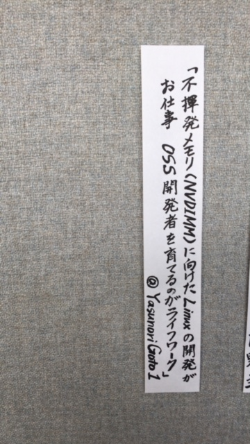

# OSS Gate のワークショップをFujitsuでも実施してみた（開催レポート）

## はじめに

はじめましての方も、そうでない方もこんにちは。
[＠YasunoriGoto1](https://twitter.com/yasunorigoto1)と申します。[Fujitsu](http://www.fujitsu.com/jp/)の中の人です。  

私は現在、本業として[Linuxの不揮発メモリ](https://qiita.com/YasunoriGoto1/items/177c7a5b22a02d087ebf)の開発に[取り組んで](https://www.mail-archive.com/linux-nvdimm@lists.01.org/msg06017.html)います。  
そのかたわら、OSSの開発者を増やすことを私のライフワークとしていて、Fujitsu社内／社外でいろいろな活動をしています。  

ちなみに、先月CROSS2017というイベントに行ったのですが、こんな感じで自己紹介を晒してました。   
  

今回、FujitsuのOSSの開発者を増やすための活動として、__Fujitsu社内__でOSS Gateのワークショップを実施することができました。  
これは、そのときの開催レポートです。  

## OSS Gateとは？

[OSS Gate](https://oss-gate.github.io/)は、もともとはFujitsuとは関連があるわけではなく、思いを同じくする"有志"による取り組みです。  
そのWebページでは以下のように紹介されています。  
```
「OSS Gate」は、OSS開発に参加する「入り口」を提供する取り組みです。
OSS開発に未参加の人を参加する人へ、少し参加したことがある人を継続的に参加する人へ。
そうやってOSS開発に参加する人を継続的に増やしていく。それが「OSS Gate」の目的です。
```

この取り組みの活動の一つとして、OSS Gateワークショップがあります。  
これは、OSSのコミュニティに参加したことがない未経験者の人に対して、経験者の方が隣についてコツを教えてあげながら、OSSコミュニティに質問やバグ報告を行う体験を__実際に__してもらうという勉強会イベントです。  
現在では、[この様子のレポート](https://oss-gate.github.io/report/workshop/2016/09/24/workshop-report-tokyo.html)や、[ビデオ](https://www.youtube.com/playlist?list=PLg41HKRyxE6gIvt3sM09REYvLYkRRkuaS)も公開されているので、  
実際の様子がどんな感じで行われているか？については、これらの資料からも分かると思います。

私はこの活動に大いに賛同し、これまでも微力ながらOSS Gateの取り組みに協力してきました。  
しかしその一方で、社外だけでなく、常々__Fujitsu社内でも__こういう活動が必要だと考えていました。  

そこで、弊社ソフト教育部門にOSS Gate ワークショップの社内の実施を強くお願いしました。  
またワークショップ実施に当たり、講師には[須藤さん](http://magazine.rubyist.net/?0053-Hotlinks)（[クリアコード](https://www.clear-code.com/)）を
ぜひお呼びしたいとお願いしました。  
須藤さんは、ご自身もRuby系の様々なOSSを開発していらっしゃるだけでなく、  
OSS Gateの主催として取りまとめていて、現在、様々なところでOSS Gateの取り組みを展開されています。

この結果、教育部門には色々な形で協力いただいて、今回のワークショップを実現することが出来たのです。   

## なぜOSSコミュニティに参加するの？

なぜ、会社としてOSSコミュ二ティに参加するのかというと、会社の立場、個人の立場、それぞれ色々な理由があると思います。  
これについては非常に深いテーマで、書き出すと非常に長くなります。  

しかし、ただ一つだけ伝えたいことを書くとするなら、私は、__Fujitsuの中のエンジニアが、OSSコミュ二ティという外の世界の人と触れられる場所に出て欲しいと__願っているからです。

これは、外の世界の人と触れることによって、
 - 今まで社内だけでは分からなかったことに気がついたり、
 - あらたな人脈を築いたり、
 - 新たな価値を生み出して欲しい
と考えているからです。

先日も隣に座っている２年目の若手にちょっとした機能提案をさせたのですが、Intelのメンテナの方が相談相手としてFacebookの中の人を召還してました。  
会社の中に閉じた仕事をしていると、Facebookの中の人の話を伺う機会は中々無いですよね？
「OSSコミュ二ティに参加することで、初めて知ることが出来る世界がある」と私は信じています。  

## 社外に出るのは怖い？

とはいえ、社外に出てOSSコミュ二ティに参加しようとするのは、色々な心理障壁があるのも事実です。  
この中でも、心理障壁として象徴的だった、あるエピソードを記載します。

ワークショップの開催前のある日、参加予定者（後で分かったのですが、今年の新人）の方から以下の質問が届いたのです。
```
Githubアカウントを登録する際に用いるメールアドレスには
社内メールアドレス(@jp.fujitsu.com)の利用は可能でしょうか？
：
(中略）
：
社内規約等で社外サービスへの社内メールアドレス(@jp.fujitsu.com)の登録が
制限・禁止されているのではないかと考えました。
：
（以下略）
：
```

( ﾟдﾟ) ・・・ (つд⊂)ｺﾞｼｺﾞｼ (；ﾟдﾟ)？！  

こういう点から、許されているかどうかをわざわざ確認したくなるとというのは、正直言うと私にとってかなり衝撃的な質問でした。
新人の方がこういう「許しを得ないといけない」と感じる雰囲気みたいなものが、うちの会社予想以上に強くて辛いのだろうか？と。

実際には、私自身や私の所属する部署、さらにはFujitsu社内の色々な部署から、業務としてLinuxやOpenStackなど様々なコミュニティに会社のメールアドレスで投稿しています。
また、これは他の多くの会社も同様です。
前述の通り統計を取ってOSSへの会社の貢献度を会社としてアピールしていますから、むしろ会社名で投稿するのは必須と言っても良いぐらい。
このような情報が伝わっていない要因はなんだろう？ そして、どうあったら、この雰囲気を変えられるだろうか？と考えることになりました。

このときは結局、私と教育部門で、以下のような回答をしました。  
- 教育受講とはいえ会社の業務であり、会社名義で問題ないこと。  
  （業務なのにプライベートのメールアドレスを使うことのほうが問題。）  
- OSS Gate開催にあたって、社内の各所とはすでに調整済みであること。    
  （実際、GitHubという公開の場所を使って、メモ書きすらも公開するワークショップを行うというのは、会社としてもはじめての経験でしたが、教育部門と共にがんばって各所と調整して、GitHubを使ったワークショップを実現しています。）
- すでに私をはじめとした様々な人が、会社名義でOSSコミュニティに参加し、OSSの開発をしていること。
- 前述の通り、会社名義のパッチの数などをカウントして、「Fujitsu」のOSSへの貢献度として色々なところでアピールしていること。
- そしてなによりも、質問者の方自身がFujitsuを代表するOSSの貢献者として、将来上記のようなアピールができるような人材になって欲しいこと！

## 会社のルールとOSS

とはいえ、会社として参加する以上、知財面のリスクなどの注意すべきことはやっぱりあります。  
弊社、知財面ではOSS参加ガイドラインがつくられています。  
これは、[Japan Technical Jamboree 60で対外発表](https://elinux.org/images/e/e7/%E3%80%90CEWG%E3%80%91OSS%E3%82%B3%E3%83%9F%E3%83%A5%E3%83%8B%E3%83%86%E3%82%A3%E5%8F%82%E5%8A%A0%E3%81%AB%E3%81%A4%E3%81%84%E3%81%A6.pdf)しているぐらい立派なものなのですが、  

しかし、こういうルールがあると、一人のエンジニアレベルでは__「あ、手続きメンドクサイ」__と敬遠してしまいがちです。
「知財部門ってOSSに理解が無いよね？」みたいに思っていたり。

じゃあ、実際のところはというと、知財部門の方と実際に話すと分かるのですが、別に知財として「OSSコミュニティに出るな！」なんて言うつもりは__まったく無い__のですよね。  
直接話を伺うと、__「むしろ、どんどんOSSコミュニティに出て欲しい」__とお話してくれます。  

私は知財部門とは面識があることもあって、このOSS Gate実施にあたって、  
社内の手続きについては事前にかなり協議しました。  
その議論の結果、以下のメッセージを参加者の方々に伝えていこうという結論になりました。

- 今の社内ルールは、たしかに一見難しく見えている。しかし、よく読んでみると当たり前のことが書いてあるし、実際に手続きをしてみると思ったほどの手間にはならない。
- 現在の法律の下では、知財面からはこれ以上は簡略化が難しいという最低限のルールにしてある。
- ルールを守ってさえくれれば、__何か問題がおきた時でも会社としてあなたを守ることができる__。
- オープンソースライセンスや、OpenStackの[Contribution License Agreement](https://secure.echosign.com/public/hostedForm?formid=56JUVGT95E78X5) のようなエンジニアには難しい文章の解釈について、この社内手続きを行うことで__知財・法務の専門化がサポートしてくれる便利なルール__と、むしろ考えて欲しい。

これについては、当日のワークショップの最後に、知財さんから皆さんにお話しすることになりました。

## OSS Gate ワークショップの開催の様子

SIerと言われ、色々な厳しいご意見を頂く弊社ですが、OSSコミュ二ティに参加したり開発した経験のある人は弊社にもいます。
当日は、そういう人の中から仕事の都合がつく人を、受講者の指導をするサポーターとして５人集めました。

そして、初心者、すなわちビギナーの方も１０名程度集まりました。
今回は、社内勉強会のメーリングリスト（現在８００人ぐらい参加）で、思いっきり宣伝したのが効いた様で、満席で参加できないという方もいました。
（今回参加してくれた中には、須藤さんが来るということで参加してくれた方もいたようです。）

扱うOSSとしては、弊社がOpenStackを推進していることもあって、OpenStackのテーマを選ばれる方がやや多かったようです。

そして、始まると皆リラックスして励むことが出来たようです。
なんといっても、須藤さん、いい意味でいつも「ふわっと」した柔らかいトークをされていて、それが非常に効果的だったと思います。

OSS Gateワークショップの内容も、外でいつも行っているワークショップと大体同じ形で進めることが出来ました。


## OSS Gate ワークショップをやってよかったこと

Fujitsu社内でOSS Gate ワークショップをやってみると、やっぱり社内でやってみて良かったなと思います。

OSS Gateは、普段土曜日や残業時間などに活動していますが、時間やお金の面で中々都合がつかないとかある人もいると思います。
そういう中で、会社の正式な教育として実施できた（つまり出張として扱うことができる）のは、意義が大きかったかな？と思っています。

また、常日頃から感じていたことですが、以下の点がOSS Gate ワークショップの長所だと思っていてこれを社内に伝えることが出来たのも良かったと思っています。

### 1. 「初心者だからこそ」の参加の仕方を教えてくれた  
   OSSの開発と言うと、すごい技術者がすごいソースを書く必要があるというイメージを持ちがちです。   
   そして、実際コミュニティにはすごい人も沢山います。  
   しかし、すごい開発者だからこそ、初心者がつまづくところが逆に分からなかったりします。  
   そういうところを分かりやすくするのは、初心者だからこそできることなのです。  
   当日は、そのような簡単な修正からやってみようということを勇気づけてくれました。  

### 2. まずは質問やバグ報告からでOK  
   OSSコミュニティに質問やバグ報告をしている人は案外少ないですよね。  
   実際、弊社でアンケートをとってみると、OSSを使っている部署は凄く多いのに、「質問やバグ報告を行っていますか？」と聞くと驚くほど少ない…。    
   実際のところ、みなさんQiitaとかで回避策を探したり、Twitterで愚痴をいうだけで終わったりしていませんか？（正直、気持ちはとても良くわかります。）  
   でも、OSSコミュ二ティ内で、その詰まったところについて、公式ドキュメントを分かりやすく直してもらうことで、今後は愚痴を言ったりする必要はなくなります。  
   OSS Gateでは、「ちょっとしたことを直すだけでも意義がある」と教えてくれます。

### 3. ほとんどのことをGitHubで行う  
   ワークショップでは、参加者の作業ログ、アンケート、また、運営側の進行方法やプレゼンの資料に至るまで、ほぼ全てに対してGitHubを活用しています。
   （例外は、chatのためのgitterと、募集のためのDoorkeeperを使っていることぐらいでしょうか？）
   さらに、最後の参加者のアンケートは、YAML形式で回答した後、GitHubでpull requestを出す形になっています。

   GitHubに慣れていない人が弊社にはまだまだ沢山いる中で、  実際に触ってpull requestまでの一連の流れを体験してもらう非常に良い機会となりました。

### 4. 良い意味で「ふわっと」している  
   弊社、（私も含めて）良くも悪くも「かっちり」しているんですよね。  
   皆色々苦労してきているので、経験を踏まえて色々なリスクに対する準備を__用意周到に__行うのが普通になって、中々先に進めない。動かない。  
   でも、最初の第一歩を踏み出すべき初心者にとっては、それだとむしろマイナスの効果が大きい…。  

   OSS Gateでは、須藤さんのお人柄も大きいのですが、「とにかくやってみようよ」って声をかけることで、  
   初心者の人を前進させるように勇気付けてくれます。これがまた、あらためていいな！って思いました。  

### 5. 最後にその場で振り返る  
   アンケートをとるのはどんなイベントでも行いますが、大体は終わってから後で集計しますよね？  
   でも、終わってからのアンケート集計だと、結果が分かるまで時間がかかります。  
   その間に熱が冷めたりして、（特に参加者にとって）次の行動につながらない可能性が高いです。  

   OSS Gateでは、”ワークショップの時間中に皆でその結果を確認し、参加者も運営側も今後の活動の継続･改善に繋げる”  
   というスタイルを取っています。その場で皆で振り返れば、だれもが次の行動にすぐ移すことができます。   

## 最後に

アンケートでは非常に好評だったこともあり、次回以降も機会を設けてFujitsu社内でも今回のような取り組みを続けたいと考えています。

一方で、社内で実施したゆえの課題が残りました。
特に、当日はビギナーの方がproxyの設定につまづいてgithub.comへのgit pushが通らなかったりしたのは、今後改善していきたいと思います。

## 謝辞、その他

何よりも、本OSS Gateを発案･主催し、当日のワークショップの講師を務めてくださった須藤さんに深く感謝します。  
須藤さんがいなければ、このような取り組みを行うことは出来ませんでした。
また、これまでOSS Gateに協力・参加してくださっている他の有志の方々全員にも感謝いたします。

さらに、弊社の教育部門、知財部門をはじめ、今回の実施提案と本レポート公開を受け入れ、調整に協力していただいた関係者の方々に感謝します。

なお、オリジナルの（つまり、富士通社外の有志の）OSS Gateも、定期的に開催していたり、関西などの各地で活動を展開しています。
これについては、[Doorkeeperで募集](https://oss-gate.doorkeeper.jp/)しているので、そちらもチェックしてくれると、個人的にもうれしいです。

以上
